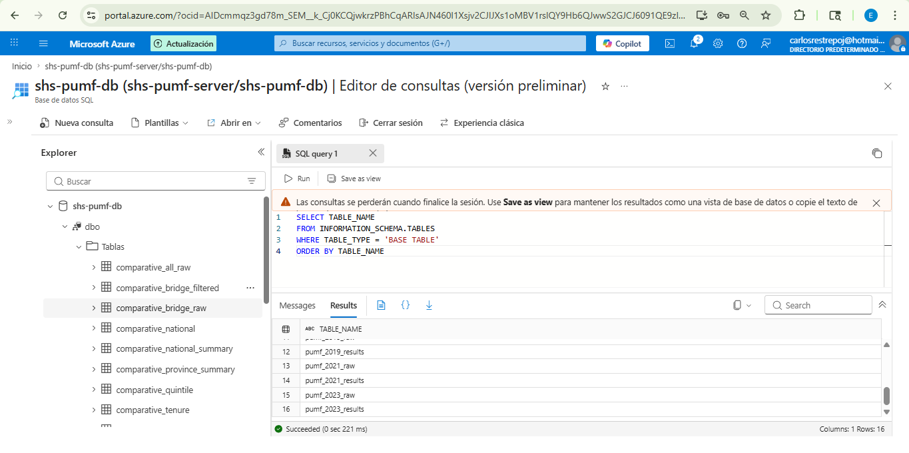
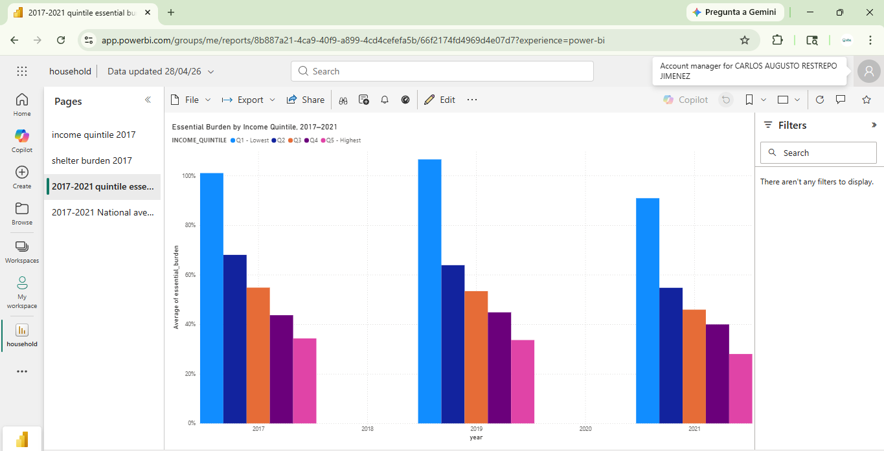
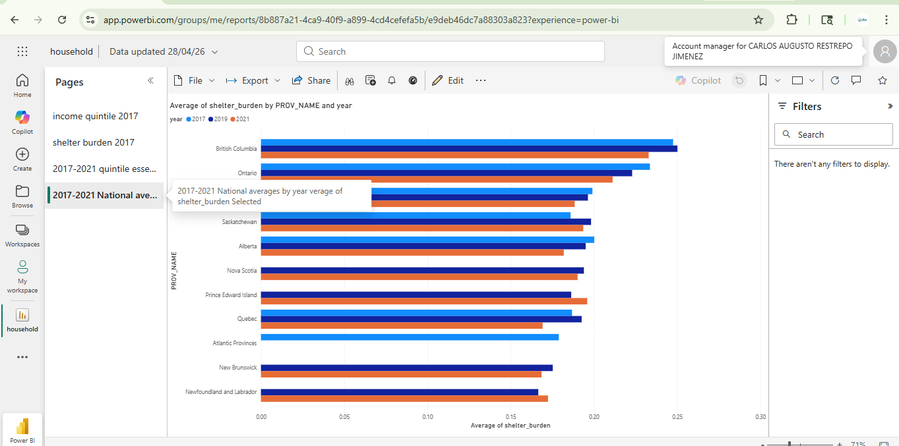

# Data & AI Portfolio — Carlos Restrepo

> Production-grade analytics pipelines, machine learning models, AI automation workflows, and regulatory compliance intelligence built with Python, scikit-learn, n8n, OpenAI, PostgreSQL, Twilio, Google Vision OCR, DuckDB, Plotly, SQLAlchemy, Azure SQL, Power BI, and Excel.

---

## Projects

| # | Project | Domain | Stack |
| --- | --- | --- | --- |
| 1 | [FINTRAC Compliance Risk Analysis — Canadian Financial Institutions (2020–2026)](#project-1) | Regulatory Analytics | Excel · Power BI · FINTRAC · OSFI · AML/ATF |
| 2 | [Credit Risk — Early Delinquency Model](#project-2) | Data Analytics & ML | Python · scikit-learn · SQLAlchemy · pandas · matplotlib |
| 3 | [Medellín Vehicle Recovery Analysis & Forecasting](#project-3) | Data Analytics & ML | Python · scikit-learn · SQLAlchemy · DuckDB · Plotly · pandas |
| 4 | [Medellín Business Leads Scraper](#project-4) | Data Engineering | Python · Google Maps API · BeautifulSoup · Selenium · pandas |
| 5 | [WhatsApp AI Assistant with Persistent Memory](#project-5) | AI Automation | n8n · OpenAI · PostgreSQL · Twilio |
| 6 | [Automated Invoice Processing (OCR + AI)](#project-6) | AI Automation | n8n · Google Vision · OpenAI · Sheets · Telegram |
| 7 | [Canadian Household Spending Analysis — SHS PUMF Comparative Core (2017, 2019, 2021) with 2023 Official Bridge](#project-7) | Public Data Analytics | Python · pandas · SQLAlchemy · Azure SQL · Power BI · Statistics Canada |

---

<a id="project-1"></a>

## Project 1 — FINTRAC Compliance Risk Analysis · Canadian Financial Institutions (2020–2026)

**EN:** End-to-end regulatory intelligence project analyzing **307 violations across 80 institutions** penalized by FINTRAC (Canada's financial intelligence unit) between 2020 and 2026. Built entirely from primary sources: FINTRAC public notices, OSFI Annual Risk Outlook 2025–2026, FCAC guidance, and Statistics Canada. The project spans four phases — regulatory framework mapping, dataset design & cleaning, research analysis (Phase 3), and quantitative compliance synthesis (Phase 4) — producing a structured Excel analytical model, a Power BI risk dashboard, and two executive-grade compliance reports. The analysis identifies enforcement patterns, sector risk profiles, provincial concentration, and the systemic drivers behind a **138% surge in violations in 2025**.

### Dataset at a Glance

| Metric | Value |
| --- | --- |
| Total violations | **307 across 80 institutions (2020–2026)** |
| Total AMP ($ penalties) | **$235.1M CAD** |
| Largest single penalty | **$176.9M CAD — Foreign Fintech MSB, BC** |
| Peak enforcement year | **2025 — 119 violations (+138% vs. 2024)** |
| Appeal rate | **40% of institutions — Federal Court** |
| Highest-risk sector | **Real Estate — 117 violations (38% of total)** |
| Provincial concentration | **BC + ON: 76% of all violations (232/307)** |
| BC penalty share | **$182.3M / $235.1M — 77.5% of total AMP** |

### Key Findings

* **A foreign Fintech MSB incorporated in BC** — operating internationally with no Canadian employees — received a $176.9M penalty for 2,593 contraventions across 6 violation types, representing **75% of all AMP in the dataset**. Currently under Federal Court appeal.
* **Real Estate + MSB account for 61% of all violations** — the two highest-risk sectors for AML/ATF non-compliance under PCMLTFA.
* **Top 3 obligation types:** Politically exposed persons obligations (106), Compliance program requirements (86), Suspicious transaction reporting (36).
* **Fintech sector** generated only 22 violations but **$203.1M in penalties** (86.4% of total AMP) — driven almost entirely by one outlier entity.
* **138% enforcement surge in 2025** (50 → 119 violations; $17.5M → $203.1M AMP) signals intensified FINTRAC regulatory posture aligned with OSFI Integrity & Security Risk escalation.
* **40% of cases are under Federal Court appeal** — indicating growing institutional resistance to FINTRAC enforcement decisions.

### OSFI Risk Alignment

| OSFI Risk Pillar | Dataset Validation |
| --- | --- |
| Integrity & Security Risk | Foreign Fintech MSB — $176.9M (2,593 contraventions) |
| Wholesale Credit Risk | Real Estate: 117 violations — highest sector |
| Funding & Liquidity Risk | Banks: $21.5M in penalties |
| Residential Mortgage Underwriting | ON + BC: highest violation concentration |

### Enforcement Trend (2020–2026)

| Year | Violations | Total AMP (CAD) | Institutions |
| --- | --- | --- | --- |
| 2020 | 6 | $353K | 2 |
| 2021 | 40 | $1.4M | 8 |
| 2022 | 52 | $2.3M | 14 |
| 2023 | 29 | $9.9M | 10 |
| 2024 | 50 | $17.5M | 12 |
| **2025** | **119** | **$203.1M** | **30** |
| 2026* | 11 | $505K | 4 |

*2026: partial year data through March 2026*

### Violations by Sector

| Sector | Violations | Institutions | Total AMP (CAD) |
| --- | --- | --- | --- |
| Real Estate | 117 | 26 | $2.9M |
| MSB | 69 | 18 | $2.4M |
| Dealer PM&S | 28 | 7 | $1.1M |
| Bank | 26 | 8 | $21.5M |
| Securities | 17 | 5 | $0.9M |
| Fintech | 22 | 7 | $203.1M |
| Credit Union | 14 | 4 | $0.7M |
| Casino | 11 | 4 | $2.6M |
| Accountant | 3 | 1 | $0.07M |

### Power BI Risk Dashboard


**4 dashboard pages:** Trend Over Time · Frequency of Infractions · Geographic Risk Heatmap · Violation & Entity Type

### Pipeline

```
Primary Source Collection (FINTRAC · OSFI · FCAC · StatsCan)
→ PCMLTFA/PCMLTFR Legal Framework Mapping
→ Dataset Design & Data Cleaning
→ Regulatory Research Analysis — 4 OSFI Risk Pillars
→ Quantitative Compliance Synthesis — 307 violations
→ Excel Analytical Model (12 sheets)
→ Power BI Risk Dashboard (4 pages)
→ Executive Compliance Reports
```

### Stack

`Excel (Power Query · Pivot Tables · Advanced Modeling)` · `Power BI` · `FINTRAC` · `OSFI` · `FCAC` · `Statistics Canada` · `PCMLTFA/PCMLTFR` · `AML/ATF` · `Git`

---

<a id="project-2"></a>

## Project 2 — Credit Risk: Early Delinquency Model

**EN:** Exploratory analysis and predictive modeling of early delinquency (60-day default within the first 6 months) on a **real credit portfolio of 235,439 records** from one of Colombia's largest consumer electronics and appliance retailers. Data was ingested and transformed using **SQLAlchemy + pandas** connected to a PostgreSQL database. The project independently evaluates a Random Forest model built around a novel feature: the **IVC (Credit Velocity Index)**, which measures how aggressively a customer has been seeking credit relative to their credit history length. Includes economic threshold optimization, three-scenario P&L comparison, and a committee-ready recommendation.

### Key Findings

| Metric | Value |
| --- | --- |
| Portfolio analyzed | **235,439 records · $570B COP** |
| Base early delinquency rate | **11.33%** |
| IVC correlation with delinquency | **r = 0.1942** |
| Income correlation with delinquency | **r = −0.003 → no signal** |
| Red zone delinquency rate (IVC > 0.09) | **22.1%** |
| Good payers inside red zone | **78%** |
| Volume at risk in red zone | **$86.2B COP (15.1% of portfolio)** |
| Model AUC | **≈ 0.68** |
| Model Recall | **≈ 56%** |

### Business Impact — 3 Scenarios

| Scenario | Net Utility | Delta vs Base |
| --- | --- | --- |
| A — No model | $81.19B COP | — |
| B — Auto-reject red zone | $77.67B COP | **−$3.52B COP** |
| C — Differentiated management (recommended) | $82.98B COP | **+$1.79B COP** |

> **Critical insight:** Automatically rejecting the entire red zone **destroys $3.52B COP** compared to doing nothing — because 78% of flagged customers are actually good payers. The right action is differentiated treatment: reduced credit limit + adjusted pricing, not binary rejection.

### Pipeline

```
Data Load (SQLAlchemy + PostgreSQL) → Cleaning → IVC Feature Engineering → EDA
→ Traffic-Light Segmentation → Economic Threshold Optimization
→ 3-Scenario P&L → Random Forest → Committee Recommendation
```

### Dashboard


### Stack

`Python` · `pandas` · `numpy` · `SQLAlchemy` · `PostgreSQL` · `matplotlib` · `seaborn` · `scikit-learn` · `Random Forest` · `Power BI` · `Flake8` · `Git`

---

<a id="project-3"></a>

## Project 3 — Medellín Vehicle Recovery Analysis & Forecasting

**EN:** End-to-end analytics project on Medellín's open vehicle recovery dataset (2003–2020), built from direct professional experience at the Secretaría de Movilidad. Data was connected and managed via **SQLAlchemy + PostgreSQL** for the 33,500+ historical records. Covers the full analytics cycle: ETL, EDA, K-Means clustering of 22 communes by risk profile, three forecasting models (linear, polynomial, EWM) projected to 2025, interactive Plotly dashboards, embedded SQL via DuckDB with window functions, and export-ready datasets for Power BI and Tableau.

### Key Findings

| Metric | Value |
| --- | --- |
| Total historical recoveries | **33,517 vehicles (2003–2020)** |
| Peak year | **2003 — 3,806 vehicles** |
| Decline peak to 2020 | **−79.5%** |
| Optimal K (elbow + silhouette) | **K = 3 clusters** |
| High-risk cluster | **Aranjuez · La Candelaria · Laureles-Estadio** |
| Selected forecast model | **EWM — base scenario to 2025** |

### Pipeline

```
Data Load (SQLAlchemy + PostgreSQL) → ETL & Data Quality → EDA → K-Means Clustering (K=3)
→ Forecasting (Linear · Polynomial · EWM) → Plotly Dashboards
→ DuckDB SQL (RANK · LAG · PARTITION BY) → Power BI / Tableau Export
```

### Stack

`Python` · `pandas` · `numpy` · `SQLAlchemy` · `PostgreSQL` · `matplotlib` · `seaborn` · `plotly` · `scikit-learn` · `KMeans` · `DuckDB` · `Power BI` · `Tableau` · `Flake8` · `Git`

### Data Source

[Datos Abiertos — Alcaldía de Medellín / MEData](https://medata.gov.co)

---

<a id="project-4"></a>

## Project 4 — Medellín Business Leads Scraper

**EN:** Data engineering pipeline that extracts and enriches **70,000+ business records** from Google Maps across 22 zones in Medellín, covering multiple sectors in the health and wellness industry. Uses a three-layer scraping strategy: **Google Maps Places API** for structured business data, **BeautifulSoup** for static site email extraction, and **Selenium** as JS-rendered fallback for dynamic sites. Each record is enriched with email, WhatsApp, and Instagram contact data, normalized with regex, and deduplicated by `place_id` to produce a CRM-ready structured database.

### Architecture

```
Google Maps Places API → Place Details
→ Layer 1: BeautifulSoup (mailto: links)
→ Layer 2: Selenium JS fallback
→ regex normalization + place_id deduplication
→ Structured Excel / CRM-ready database
```

### Capabilities

* **70,000+ business records** across 22 zones in Medellín metro area
* Three-layer extraction: Google Maps API → BeautifulSoup → Selenium fallback
* Email, WhatsApp, and Instagram contact extraction
* `place_id` deduplication across all zones
* Output columns: Nombre · Dirección · Teléfono · Web · Email · WhatsApp · Instagram · Rating · Zona · Categoría

### Stack

`Python` · `Google Maps Places API` · `BeautifulSoup` · `Selenium` · `pandas` · `requests` · `regex` · `openpyxl` · `Flake8` · `Git`

---

<a id="project-5"></a>

## Project 5 — WhatsApp AI Assistant with Persistent Memory

**EN:** Fully automated WhatsApp assistant powered by AI that maintains persistent conversation memory, understands user intent, and responds contextually. Deployed via Twilio webhooks and orchestrated through n8n. Production-deployed on Docker/VPS with webhook architecture. Designed and implemented a PostgreSQL database for an automated WhatsApp appointment scheduling system.

### Architecture

```
WhatsApp → Twilio Webhook → n8n → AI Agent (OpenAI) → PostgreSQL Memory → WhatsApp Response
```

[Watch the WhatsApp automation video](https://www.ebs.com.co/agendaia/)

### Stack

`n8n` · `OpenAI API` · `PostgreSQL` · `Twilio WhatsApp API` · `Webhooks` · `Docker` · `VPS` · `Git`

---

<a id="project-6"></a>

## Project 6 — Automated Invoice Processing (OCR + AI)

**EN:** Fully automated pipeline that extracts structured financial data from invoice images received via Gmail. Combines Google Vision OCR with LLM extraction to convert unstructured images into structured records in Google Sheets, with Telegram notifications.

### Architecture

```
Gmail → Google Vision OCR → LLM Extraction → Data Normalization → Google Sheets → Telegram Notification
```

### Stack

`n8n` · `Google Vision OCR` · `OpenAI API` · `Google Sheets API` · `Telegram API` · `Gmail API` · `Git`

---

<a id="project-7"></a>

## Project 7 — Canadian Household Spending Analysis · SHS PUMF Comparative Core (2017, 2019, 2021) with 2023 Official Bridge

**EN:** End-to-end public data analytics project conducting a comparative household spending analysis using Statistics Canada's **SHS PUMF microdata for 2017, 2019, and 2021**, extended with a **2023 official aggregate bridge** based on published Statistics Canada tables. The project covers the full pipeline: data cleaning and harmonization across three PUMF cycles, weighted statistical analysis with bootstrap confidence intervals, sector deep dives into Food & Consumer and Insurance, and comparative analysis across income quintiles, tenure groups, and provinces. All analytical outputs are stored in **Azure SQL** (16 tables ingested via Python/SQLAlchemy from Jupyter notebooks). Dashboard development was completed in **Power BI using exported analytical CSV tables** from the Azure SQL database.

The analysis spans **17,590 harmonized household records** across three PUMF microdata years — 3,699 households in 2017 (441 variables), 7,566 in 2019 (404 variables), and 6,325 in 2021 (398 variables) — plus the 2023 official aggregate extension from Statistics Canada table 11-10-0222-01.

### Research Question

Why do Canadian household spending patterns vary across provinces, income quintiles, and tenure groups, and how did those differences evolve across the SHS PUMF comparative core years (2017, 2019, 2021), with a 2023 official bridge extending the post-COVID context?

### Dataset at a Glance

| Year | Source | Households | Variables | Type |
| --- | --- | --- | --- | --- |
| 2017 | SHS PUMF | 3,699 | 441 | Microdata |
| 2019 | SHS PUMF | 7,566 | 404 | Microdata |
| 2021 | SHS PUMF | 6,325 | 398 | Microdata |
| 2023 | Statistics Canada Official Aggregate (11-10-0222-01) | 44,265 aggregate rows | 16 | Official table bridge |

### Key Findings

**Income & Essential Burden**
* Average household income rose from **$84,689 (2017) → $92,883 (2019) → $103,048 (2021)** — a 21.7% increase over the period.
* Households in the **lowest income quintile (Q1)** spent **101.0% of income on shelter + food + transport in 2017**, and **106.5% in 2019** — leaving nothing for anything else. By 2021 that figure eased to **90.9%**, still meaning 9 of every 10 dollars went to just three essentials.
* The **top quintile (Q5)** carried a combined burden of just **28–34%** across the same years — a structural gap that persisted throughout the entire period.

**Shelter**
* **British Columbia** had the highest shelter burden every year: **24.8% (2017) · 25.0% (2019) · 23.3% (2021)** — verified with bootstrap 95% confidence intervals.
* **Ontario** consistently second at **23.4% · 22.3% · 21.1%**. **Quebec** consistently lowest among major provinces at **18.7% · 19.3% · 16.9%**.
* **Q1 shelter burden** reached **53.6% in 2017 and 55.1% in 2019** — statistically distinct from all other quintiles every year.
* **Renters** faced shelter burdens of **26.5% · 26.2% · 24.0%** vs. **12.5% · 13.2% · 11.7%** for owners without a mortgage. Residual income: owners without mortgages had **$60K–$74K** left after essentials; renters had **$22K–$33K**.

**Food**
* Total food spending rose **21.0%** from **$8,529 (2017) to $10,318 (2019)** and remained flat at $10,306 in 2021. Restaurant share collapsed from **30.4% → 26.9% → 21.3%** as COVID shifted spending toward grocery stores (store share reached **78.2%** by 2021).
* Strongest subcategory growth 2017–2021: **cereal grains +44.5%**, **dairy +38.3%**, **meat +36.7%**.
* **Q1 food burden**: **22.5% · 25.7% · 23.3%** — more than 3× the Q5 burden of 7.0% · 7.7% · 7.0%.

**2023 Official Bridge**
* The 2023 extension uses Statistics Canada's published official aggregate table rather than PUMF microdata, as the 2023 PUMF has not yet been released publicly as of April 2026. It is strongest for national expenditure levels, food and shelter structure, and provincial spending comparisons. It does not reproduce quintile, tenure, or bootstrap CI analysis at the same granularity as the PUMF core years.
* Key 2023 signal: national food expenditure structure shows continued dominance of store-based food; the restaurant share began a partial post-COVID recovery from the 2021 low of 21.3%.

### Azure SQL Infrastructure

All cleaned and analytical outputs were ingested into **Azure SQL (Canada Central)** — `shs-pumf-server` / `shs-pumf-db` — via Python + SQLAlchemy + pyodbc directly from Jupyter notebooks.


*Azure SQL Query Editor — 16 tables · Succeeded · 221ms · shs-pumf-db · Canada Central*

| Table | Description | Rows |
| --- | --- | --- |
| `pumf_2017_raw` | Full microdata 2017 | 3,699 |
| `pumf_2019_raw` | Full microdata 2019 | 7,566 |
| `pumf_2021_raw` | Full microdata 2021 | 6,325 |
| `pumf_2023_raw` | Official aggregate 2023 | 44,265 |
| `pumf_2017_results` | Province-level results 2017 | 7 |
| `pumf_2019_results` | Province-level results 2019 | 10 |
| `pumf_2021_results` | Province-level results 2021 | 10 |
| `pumf_2023_results` | Province-level results 2023 | 13 |
| `comparative_all_raw` | Harmonized microdata 2017–2021 | 17,590 |
| `comparative_national` | National summary by year | 3 |
| `comparative_national_summary` | National indicators | 3 |
| `comparative_province_summary` | Provincial summary 2017–2021 | 27 |
| `comparative_quintile` | Quintile comparison | 15 |
| `comparative_tenure` | Tenure comparison | 9 |
| `comparative_bridge_raw` | 2023 official bridge full | 44,265 |
| `comparative_bridge_filtered` | 2023 bridge filtered | 77 |

### Power BI Dashboard

Analytical tables were stored in Azure SQL. Dashboard development was completed in Power BI using exported analytical CSV tables from the Azure SQL database. 4 pages covering income quintile burden analysis, shelter burden by province and tenure, national spending trends 2017–2021, and comparative averages by year.


*Essential Burden by Income Quintile, 2017–2021 — Q1 carried 90–106% of income in essential spending vs. 28–34% for Q5*


*Average shelter burden by province and year — BC consistently highest, Quebec lowest among major provinces*

### Pipeline

```
Statistics Canada SHS PUMF (2017 · 2019 · 2021) + Official 2023 Aggregate Table
→ Data Cleaning & Harmonization (Python · pandas · Jupyter)
→ Weighted Statistical Analysis + Bootstrap CI (95%)
→ Sector Deep Dives: Food & Consumer · Insurance
→ Comparative Core: Quintile · Tenure · Province · Year
→ Azure SQL Ingestion — 16 tables (SQLAlchemy · pyodbc)
→ Power BI Dashboard (analytical CSV exports from Azure SQL)
```

### Stack

`Python` · `pandas` · `numpy` · `SQLAlchemy` · `pyodbc` · `Azure SQL` · `Power BI` · `Jupyter` · `matplotlib` · `seaborn` · `Bootstrap CI` · `Statistics Canada SHS PUMF` · `Git`

### Data Sources

* [Statistics Canada — Survey of Household Spending PUMF 2017, 2019, 2021](https://www.statcan.gc.ca/en/microdata/shs)
* [Statistics Canada — Official SHS Aggregate Table 11-10-0222-01 (2023)](https://www150.statcan.gc.ca/t1/tbl1/en/table.identifier=11100222)

---

## Tech Stack

| Tool | Role |
| --- | --- |
| Python | Data pipelines, analytics & ML |
| pandas · numpy | Data manipulation & feature engineering |
| matplotlib · seaborn | Static visualizations & EDA |
| scikit-learn | Machine learning — Random Forest · K-Means |
| plotly | Interactive HTML dashboards |
| SQLAlchemy | ORM — Python-to-database connection & data ingestion |
| PostgreSQL | Persistent memory & relational storage |
| Azure SQL | Cloud relational database — SHS PUMF project |
| DuckDB | Embedded SQL with window functions |
| Power BI | Business intelligence dashboards & KPI reporting |
| Excel (Power Query · Power Pivot · VBA) | Advanced financial modeling & data transformation |
| BeautifulSoup | Static HTML parsing & email extraction |
| Selenium | JS-rendered web scraping fallback |
| Google Maps Places API | Geospatial business data extraction |
| n8n | Workflow orchestration & automation |
| OpenAI / LLM | Natural language processing & structured extraction |
| Google Vision OCR | Document & invoice data extraction |
| Twilio WhatsApp API | Messaging integration |
| Telegram API | Automated notifications |
| Docker / VPS | Production deployment |
| FINTRAC / OSFI / FCAC | Canadian regulatory data sources |
| Statistics Canada SHS PUMF | Canadian household spending microdata |
| Bootstrap CI | Statistical confidence intervals |
| Flake8 | Code linting & quality standards |
| Git | Version control |

---

## Author

**Carlos Restrepo**
MBA | Data Analytics & AI Automation Engineer | Vancouver, BC, Canada

Specialized in:

* Credit risk analytics & predictive modeling
* Feature engineering from behavioral data
* AI automation & conversational agents
* Intelligent document processing (OCR + LLM)
* End-to-end data pipelines & open data analytics
* Business intelligence dashboards (Power BI · Tableau · Plotly)
* Public sector data engineering & geospatial analytics
* Regulatory compliance intelligence (FINTRAC · OSFI · AML/ATF)
* Canadian household spending & affordability analytics (SHS PUMF)

🔗 [github.com/ebseducacioncolombia-tech](https://github.com/ebseducacioncolombia-tech)
🔗 [linkedin.com/in/carlos-augusto-restrepo-jimenez](https://www.linkedin.com/in/carlos-augusto-restrepo-jimenez/)
